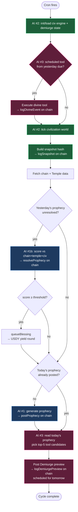
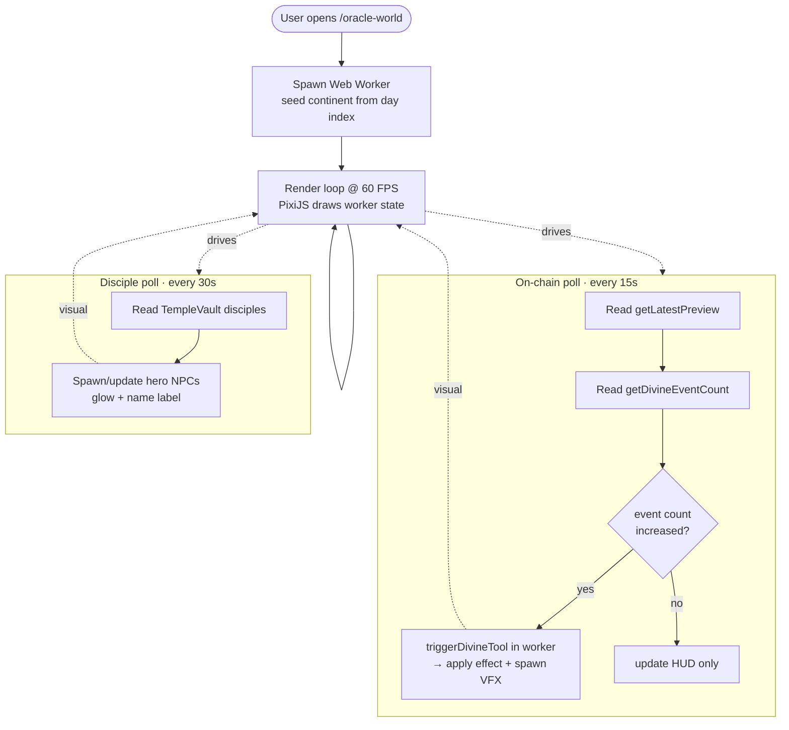
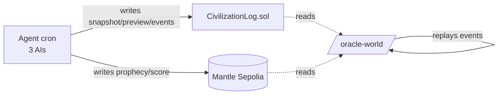

# Architecture — Activity Diagrams

Two views: the **daily agent cycle** (backend, on a cron) and the **live frontend
loop** (`/oracle-world` in the browser). Both render natively on GitHub via Mermaid.

---

## 1. Daily 3-AI Cycle (agent/src/index.ts)

Runs once per UTC day (or every 30s in `DEMO_MODE`). Swimlanes = which actor owns
each step.

**Legend:** 🔵 AI #1 Oracle (prophecy + scoring) · 🟢 AI #2 Civilization Engine
(deterministic sim, no LLM) · 🔴 AI #3 Demiurge (tool selection + execution).

---

## 2. Live Frontend Loop (/oracle-world)

The browser runs the simulation locally for 60 FPS visuals while polling the chain
for the AI's real decisions, then replays them visually.

---

## 3. Data Flow Summary

> **Note:** `CivilizationLog.sol` not yet deployed on Sepolia. Until deployed +
> `NEXT_PUBLIC_CIVILIZATION_LOG_ADDRESS` set, the frontend `civlog` read path
> returns empty → DivineToolsPanel shows mock data. See `STATUS-AND-ROADMAP.md`.
