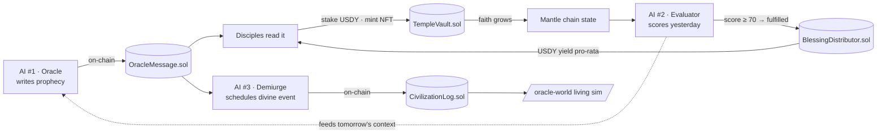

# Cult of the Digital Oracle

> An autonomous AI prophet that reads the Mantle blockchain, speaks cryptic prophecies on-chain, and judges whether its own words came true — while a second and third AI quietly play god over a living pixel civilization.

<p align="center">
  
  
  
  
  
  
  
</p>

<p align="center">
  <b>Live:</b> <a href="https://web-red-nine-58.vercel.app">web-red-nine-58.vercel.app</a>
</p>

***

## What is it?

**Cult of the Digital Oracle** is an experiment in **autonomous AI belief economies on Mantle**. It is not "AI plus crypto." It is an *auditable AI ritual* with on-chain memory, soulbound identity, and real economic consequences.

Every UTC day, an AI agent wakes up and:

1. **Reads the chain** — Mantle activity, USDY volume, and its own cult (how many Disciples joined, how much faith is staked, who left).
2. **Speaks a prophecy** — a cryptic one-to-three sentence omen, written *immutably* to `OracleMessage.sol`.
3. **Judges yesterday** — a second AI scores whether the previous prophecy actually came true (0–100), and records the verdict with evidence.
4. **Plays god** — a third AI, the **Demiurge**, reads the prophecy and schedules a *divine event* (a meteor, a plague, a golden age) on a living simulated civilization rendered in pixel-art at [`/oracle-world`](frontend/oracle-world.md).

Believers stake **USDY** into the **Temple**, mint a **soulbound Disciple NFT**, and when a prophecy is judged *fulfilled*, USDY yield flows pro-rata to the faithful.


**The twist that makes it viral:** the prophecy *creates the behavior that makes it true*. When the Oracle predicts growth and Disciples stake to fulfill it, the Evaluator scores it high, blessings flow, and the cycle reinforces itself — **a self-fulfilling economy mediated entirely by autonomous AI agents on-chain.**


***

## The Self-Fulfilling Loop



The prophecy is not a text generator shouting into the void. It watches its own community, and the community moves the metrics the prophecy is later judged against. Belief becomes the input *and* the output.

***

## The Turing Test, inverted

This is the **Turing Test Hackathon** — but the project flips the question. It never asks *"is this an AI?"* It asks *"do you believe it?"*

* Every AI decision — the prophecy text, the fulfillment score, the divine event — is a **permanent Mantle transaction**. The AI cannot retcon its predictions.
* That makes the chain an **immutable benchmark of an autonomous agent's performance over time** — exactly the kind of auditable AI behavior the hackathon is built to surface.
* The "test" the user is taking, without realizing it, is whether an on-chain AI ritual can be compelling enough to stake real value on. Forty-seven Disciples saying *yes* is the result.

→ Read more in [The Turing Test Angle](concept/turing-test.md).

***

## Find your path



1. [The Belief Economy](concept/README.md) — the one-page thesis
2. [System Overview](architecture/README.md) — 3 AIs, 5 contracts, one loop
3. [The Triune Intelligence](ai-agents/README.md) — what makes the AI layer real
4. [Demo Walkthrough](demo/README.md) — see it move
5. [Pitch & Judge Q&A](launch/pitch.md) — the hard questions, answered



1. [Quick Start](quick-start.md) — connect wallet, get test USDY
2. [The Oracle Loop](concept/oracle-loop.md) — what the daily ritual means
3. [TempleVault](contracts/temple-vault.md) — staking, your soulbound NFT, karma
4. [BlessingDistributor](contracts/blessing-distributor.md) — how yield reaches you



1. [Quick Start](quick-start.md) — clone and run all three workspaces
2. [Technology Stack](architecture/tech-stack.md) — the full dependency map
3. [Smart Contract API](api/contracts.md) — every function, every event
4. [Deployment Guide](deployment/README.md) — ship your own oracle



1. [The Triune Intelligence](ai-agents/README.md) — three roles, three models
2. [The Demiurge](ai-agents/demiurge.md) — tool selection over a living world
3. [The Civilization Engine](ai-agents/civilization-engine.md) — the simulation
4. [Data Flow](architecture/data-flow.md) — end-to-end sequence diagrams



***

## The stack at a glance

| Layer | Technology |
|---|---|
| **Frontend** | Next.js 16 (App Router, Turbopack), React, Tailwind v4, TypeScript |
| **Web3** | wagmi v2, viem, ConnectKit |
| **Contracts** | Hardhat, Solidity 0.8.27 (Cancun EVM), OpenZeppelin |
| **AI Agents** | Node.js, ethers v6, OpenAI SDK → **OpenRouter** (Gemini 2.5 Flash · Claude 3.5 Sonnet) |
| **Simulation** | Web Worker civilization sim + WebP sprite atlases |
| **Network** | Mantle Sepolia (chainId `5003`) |
| **Hosting** | Vercel (frontend) · GitHub Actions cron (agent) |

Five contracts carry the whole economy. Their verified addresses live in **[Deployment & Addresses](contracts/deployment.md)**.

| Contract | Role |
|---|---|
| [`OracleMessage`](contracts/oracle-message.md) | One immutable prophecy + verdict per UTC day |
| [`TempleVault`](contracts/temple-vault.md) | USDY stake → soulbound Disciple NFT + karma |
| [`BlessingDistributor`](contracts/blessing-distributor.md) | Pro-rata USDY yield on fulfilled prophecies |
| [`CivilizationLog`](contracts/civilization-log.md) | Daily world snapshots + Demiurge divine events |
| [`MockUSDY`](contracts/mock-usdy.md) | Test ERC-20 (6 decimals) with a public faucet |

***

## Repository map

```text
refactored-Main/
├── apps/web/                  # Next.js 16 frontend
│   └── src/
│       ├── app/               # routes: /, /temple, /prophecies,
│       │                      #         /leaderboard, /disciple/[id], /oracle-world
│       ├── components/        # ProphecyCard, DiscipleCard, OracleWorld/*
│       └── lib/               # wagmi, contract ABIs, civilization sim, assets
├── contracts/                 # Hardhat project — 5 Solidity contracts
│   ├── contracts/             # OracleMessage, TempleVault, BlessingDistributor,
│   │                          # CivilizationLog, MockUSDY
│   └── scripts/               # deploy, demo-seed, topup
├── agent/                     # The three autonomous AIs
│   └── src/
│       ├── index.ts           # daily cron orchestration
│       ├── generateProphecy.ts  # AI #1 — the Oracle
│       ├── evaluateProphecy.ts  # AI #2 — the Evaluator
│       ├── demiurge/          # AI #3 — the Demiurge + divine tools
│       └── civilization/      # the living-world engine
└── docs/                      # ← you are here
```

***

## Why Mantle?


The Mantle integration is load-bearing, not decorative:

* **USDY** — Disciples stake Mantle's real-world-asset stablecoin, not a synthetic token. Yield is a genuine RWA narrative.
* **Soulbound identity** — every Disciple is an ERC-721 bound to its wallet; identity, not a tradeable asset.
* **On-chain AI memory** — every prophecy, every verdict, every divine event is a permanent Mantle transaction. The chain *is* the AI's auditable track record — which is precisely what a Turing-test benchmark needs.
* **Cheap, fast finality** — daily cron writes from three agents stay economical on Mantle's L2.


***

## Quick links

* [Quick Start →](quick-start.md)
* [The Belief Economy →](concept/README.md)
* [The Triune Intelligence →](ai-agents/README.md)
* [Smart Contracts →](contracts/README.md)
* [Demo Walkthrough →](demo/README.md)
* [Live App →](https://web-red-nine-58.vercel.app)

***

*Built for the [Mantle Turing Test Hackathon 2026](https://dorahacks.io/hackathon/mantleturingtesthackathon2026) — Consumer & Viral DApps. MIT License.*
