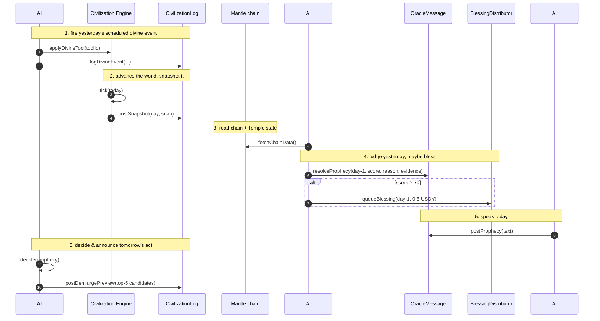

# The Triune Intelligence

Most "AI + crypto" projects have one model behind a chat box. Cult of the Digital Oracle has **three autonomous LLM agents** with distinct roles, distinct models, and distinct on-chain authority — orchestrated once per UTC day by `agent/src/index.ts`, acting on a fourth, deterministic substrate: a living simulated civilization.


The agents never talk to a user. They read the chain and a simulated world, make decisions, and **write those decisions to Mantle as permanent transactions.** Their only audience is the ledger — and the believers reading it.


***

## Three minds, one ritual

| | Agent | File | Default model | Writes to | Job |
|---|---|---|---|---|---|
| **AI #1** | [The Oracle](oracle.md) | `generateProphecy.ts` | `google/gemini-2.5-flash` | `OracleMessage` | Speaks the daily prophecy |
| **AI #2** | [The Evaluator](evaluator.md) | `evaluateProphecy.ts` | `google/gemini-2.5-flash` | `OracleMessage` + `BlessingDistributor` | Judges if yesterday's prophecy came true |
| **AI #3** | [The Demiurge](demiurge.md) | `demiurge/*` | `anthropic/claude-3-5-sonnet` | `CivilizationLog` | Plays god over the simulated world |

And beneath them:

| | System | File | Nature | Writes to |
|---|---|---|---|---|
| **The world** | [Civilization Engine](civilization-engine.md) | `civilization/*` | **Deterministic** (no LLM) | `CivilizationLog` |

All three agents speak the **OpenAI SDK dialect**, pointed at **OpenRouter** (`https://openrouter.ai/api/v1`). Each role has its own API-key slot (`ORACLE_API_KEY`, `EVALUATOR_API_KEY`, `DEMIURGE_API_KEY`), each falling back to a shared `OPENROUTER_API_KEY`.


**Provider note:** the repo's older `README.md` / `CLAUDE.md` mention Groq + `llama-3.3-70b`. The shipped code uses **OpenRouter** with the models above (`agent/src/index.ts`). Trust the code and `agent/.env.example`.


***

## The daily cycle

`runOracleCycle()` runs the whole ritual in order. It executes immediately on startup and then on `CRON_SCHEDULE` (default `0 0 * * *` — midnight UTC).

The numbering matches the comments in `index.ts`. Note the elegant causality: **the Demiurge reads today's prophecy to schedule tomorrow's divine event, and the Evaluator reads the world the Demiurge shaped to judge the prophecy.** The three minds form a closed loop through the chain.

***

## Why three models, not one

* **Separation of authority.** The Oracle can only post prophecies; the Evaluator can only resolve them and queue blessings; the Demiurge can only touch the civilization log. No single agent can both predict *and* pay itself.
* **Separation of temperament.** The Oracle runs hot (`temperature 0.9`) — it should be poetic and surprising. The Evaluator runs cold (`temperature 0.15`) — it should be a strict, repeatable judge. The Demiurge parses sentiment at `temperature 0.1` and then decides **deterministically** with a seeded RNG, so its choice is reproducible and auditable.
* **Separation of belief.** Splitting the roles is what lets the system *grade itself honestly*. A prophecy graded by the same mind that wrote it would be theatre. A different model, with a different prompt and a hybrid deterministic floor, makes the verdict defensible.

***

## Determinism where it counts

Two of the most consequential decisions are **not** left to an LLM:

1. **The Evaluator's score** is a blend — the LLM's semantic judgment is only 50% of it. The other 50% comes from deterministic on-chain and simulation signals (transaction volume, Temple growth, population/faith deltas). The AI cannot simply *declare* a prophecy fulfilled; the chain has to agree. See [The Evaluator](evaluator.md).
2. **The Demiurge's tool pick** uses a seeded PRNG (`seedrandom("demiurge-pick-{day}-{prophecy excerpt}")`) over LLM-weighted candidates, and a [balance tracker](demiurge.md#cosmic-balance) that forces good/evil to stay roughly 50/50 over a rolling window. The god is whimsical, but never unfair.

This hybrid design — LLM for language and intent, determinism for money and fairness — is the spine of the whole project.

***

## Read on

* [AI #1 — The Oracle](oracle.md)
* [AI #2 — The Evaluator](evaluator.md)
* [AI #3 — The Demiurge](demiurge.md)
* [The Civilization Engine](civilization-engine.md)
* [Data Flow](../architecture/data-flow.md) — the same cycle as full sequence diagrams
