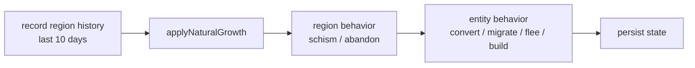

# The Civilization Engine

> `agent/src/civilization/*` · **deterministic — no LLM**

Beneath the three AI agents lives a small world. The Civilization Engine is a deterministic simulation of a pixel civilization — regions, entities, faith, factions — that advances one day at a time, commits a hash of its state to [`CivilizationLog`](../contracts/civilization-log.md), and absorbs the [Demiurge's](demiurge.md) divine interventions.


It is **not** a fourth LLM. Given the same seed and the same divine events, it produces exactly the same history every time. That determinism is what makes the on-chain `stateHash` meaningful — anyone can replay the world and verify the snapshot.


***

## The world model

`CivWorldState` (`civilizationEngine.ts`):

```ts
{ day, seed,
  regions: Region[],     // settlements on a 100×100 grid
  entities: Entity[],    // the population
  totalPopulation, totalFaith,
  dominantFaction: 'believer' | 'apostate' | 'balanced',
  activeRegions, lastUpdatedAt }
```

**A fresh world** (`createNewWorld`, seed `oracle-civ-{dayIndex}`) begins with **3 regions** and **100 entities**:

| Region | Faction | Start population | Start faith |
|---|---|---|---|
| (25, 35) | believer | 30 | ~75 |
| (75, 45) | apostate | 30 | ~20 |
| (50, 75) | wanderer | 40 | ~50 |

Each `Entity` has a `type`, `faith` (0–100), `karma`, and `health`; each `Region` has `population`, `faith`, `resources`, a `faction`, and a position.

***

## One day = one `tick()`

`tick(targetDay)` advances the world through several deterministic phases:



### Natural growth (`naturalGrowth.ts`)

Organic evolution, no god required:

* **Logistic growth** toward carrying capacity `K = 200` at `baseGrowthRate = 0.08`: `dP = r·P·(1 − P/K)`.
* **A 7-day seasonal cycle** — winter (days 0, 6) ×0.8, harvest (day 3) ×1.3.
* **Faith decays ×0.98 per day** with no divine event — belief fades unless fed.
* Resources regenerate `+5` and are consumed `−0.05 × population`.
* Entities drift toward their region's faith (±jitter), heal `+2` when resources are plentiful, starve `−3` when scarce; an entity at `health ≤ 0` is removed.
* A region's **faction** is reassigned by faith thresholds (>60 believer, <40 apostate, else wanderer). The world's **dominant faction** is whichever exceeds the other by ×1.2, else `balanced`.

### Region & entity behavior (`entityBehavior.ts`)

* **Schism:** a region over 150 population may split, founding a new region and migrating ~10 entities (faith carried at ×0.8).
* **Abandon:** an empty region, or one whose faith stays below 10 for three straight days, is deactivated.
* **Per entity:** `health < 20` → **flee** to the safest high-resource region; `faith < 30` → **convert** (believer↔apostate flip) or **migrate** toward an aligned region; `faith > 70` → **build** (adds region resources + karma); otherwise idle.

***

## Divine intervention

When the Demiurge fires a tool, `applyDivineTool(toolId, params)` mutates the world and returns `{ success, affectedEntities, affectedRegions[], description }`. The server-side effects (the *authoritative* outcome that gets snapshotted) are:

| id | Tool | Server-side effect |
|:--:|---|---|
| 0 | Blessing Rain | all entities faith +25 / health +10; regions faith +20 |
| 1 | Harvest Tide | regions resources +50; entities health +20 |
| 2 | Missionary Wave | spawn **20** believers (faith 80–99) in target region |
| 3 | Architect Gift | found a new region (pop 15, faith 60) + 15 settlers |
| 4 | Peace Covenant | entities karma +30 / health +15; regions move toward harmony |
| 5 | Meteor Strike | kill **40%** of target-region entities; resources −50; faith −20 |
| 6 | Plague Wave | target + 30% random regions: health −40, faith −10, resources −30 |
| 7 | Drought | regions resources −60; entities health −15 |
| 8 | Civil War Seed | target region: health −25, faith −15, karma −30; resources −30 |
| 9 | Apostasy Wave | all entities faith −40 → apostate; regions faith −30 |

After every intervention, natural growth re-runs so the shock propagates. (The browser visualization in [`/oracle-world`](../frontend/oracle-world.md) applies its *own* cinematic version of these effects — same `toolId`, different radii and sprite counts, tuned for spectacle rather than the canonical sim.)

***

## Committing to the chain

`civSnapshot.ts` turns the world into the on-chain record:

* **`buildSnapshot(world)`** produces the `CivSnapshot` payload — `totalEntities`, `totalPopulation`, `totalFaith` (×1e6 to 6 decimals), `dominantFaction` (0/1/2), `activeRegions`, `snapshotAt`, and the all-important `stateHash`.
* **`stateHash`** = `keccak256` of `JSON.stringify({ day, regions, totalPopulation, totalFaith, dominantFaction, activeRegions })`. It anchors the exact world state for that day. (The entity array is intentionally excluded from the hash to keep it compact.)
* **`postSnapshotToChain(...)`** calls `CivilizationLog.postSnapshot(day, snap)`; **`postDivineEventToChain(...)`** calls `logDivineEvent(ev)`.

State persists across runs in `civ-state.json` + `civ-history.json`.

***

## Why a deterministic world matters

The simulation gives the three LLM agents something **real and measurable** to predict, judge, and act upon — without handing the outcome to a model. The Oracle predicts the world's fate; the Demiurge nudges it; the Evaluator measures the delta. Because the engine is deterministic and its state is hashed on-chain, none of that can be quietly rewritten after the fact. It is the stage on which the AI ritual is provably performed.

***

## Read next

* [AI #3 — The Demiurge](demiurge.md) — who acts on this world
* [CivilizationLog](../contracts/civilization-log.md) — the on-chain ledger of snapshots & events
* [The Oracle World](../frontend/oracle-world.md) — the world rendered in real time
