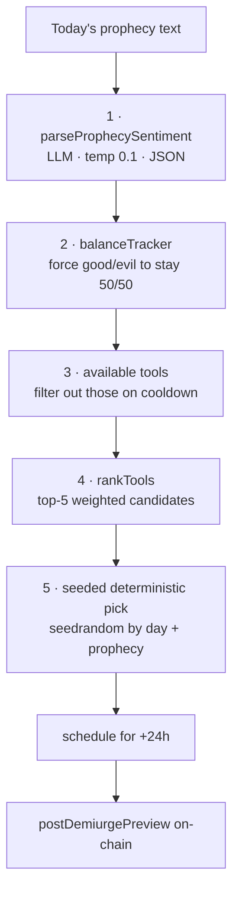

# AI #3 — The Demiurge

> `agent/src/demiurge/*` · default model `anthropic/claude-3-5-sonnet`

The god of the simulated world. The Demiurge reads each day's prophecy, decides which **divine intervention** would make it come true, announces its intent on-chain a full day in advance, and then — the next day — actually reaches into the [Civilization Engine](civilization-engine.md) and fires it. A meteor. A plague. A golden harvest. A wave of apostasy.

This is the agent that turns a prophecy from *prediction* into *self-fulfilling decree*.

***

## The decision pipeline

`DemiurgeAgent.decide(prophecyText, currentDay)` runs five stages:



### 1. Read the prophecy's mood

`parseProphecySentiment` (`prophecyParser.ts`) asks the LLM, at `temperature 0.1` with `response_format: json_object`, to distill the prophecy into:

```ts
{ tone: 'positive' | 'negative' | 'neutral',
  keywords: string[],
  intensity: 'mild' | 'moderate' | 'severe',
  impliedEvent: string }
```

If the LLM call fails, a deterministic `getFallbackSentiment` keyword-matcher takes over (positive words like `growth, bless, harvest, peace`; negative words like `meteor, plague, drought, apostate`) so the Demiurge always reaches a decision.

### 2. Keep the cosmos balanced {#cosmic-balance}

The `BalanceTracker` (`balanceTracker.ts`) keeps a rolling window of the **last 10** divine acts. Before choosing, it computes a forced polarity:

| Last-10 balance | Forced polarity |
|---|---|
| `good − evil > 1` | **force evil** |
| `good − evil < −1` | **force good** |
| otherwise | **free** (prophecy decides) |

So the world can never tip into permanent paradise or permanent doom — the god self-corrects toward a strict 50/50 over time. The frontend's [Cosmic Alignment Index](../frontend/oracle-world.md) visualizes exactly this counter.

### 3 & 4. Rank the candidates

`rankTools` (`toolSelector.ts`) filters the catalog to tools that are **off cooldown** and match the forced polarity, then scores each:

* base **50**
* **+25** if the tool's theme aligns with the prophecy's tone (**−20** if it clashes)
* **+15** per matched keyword (each tool has a thematic keyword set — Meteor Strike matches `meteor, strike, fire, sky, crash, obliterate, heaven, space`)

The top 5 are normalized into probability **weights summing to ~100**. Intensity tunes the spread: `severe` multiplies the leading candidate (×1.4, capped 95); `mild` flattens everything toward 20.

### 5. Pick — deterministically

The final choice is **not** random in a way you can't reproduce:

```ts
const rng = seedrandom(`demiurge-pick-${day}-${prophecy.slice(0,10)}`);
const roll = rng() * 100; // walk the accumulated weights
```

Same day + same prophecy → same pick, every time. The god is whimsical but auditable.

***

## The divine-tool catalog

Ten tools, indexed `0–9`. **Tools 0–4 are good, 5–9 are evil.** This is the canonical backend catalog (`demiurge/divineTools.ts`), which also defines each tool's effect in the [Civilization Engine](civilization-engine.md) and its cooldown.

| id | Tool | Polarity | Cooldown | Effect on the world |
|:--:|---|:--:|:--:|---|
| 0 | **Blessing Rain** | 😇 good | 2 d | +faith & health to all entities, +faith to all regions |
| 1 | **Harvest Tide** | 😇 good | 3 d | +50% resources all regions, +health |
| 2 | **Missionary Wave** | 😇 good | 4 d | Spawn ~20 new believer entities in a region |
| 3 | **Architect Gift** | 😇 good | 5 d | Found a new settlement + settlers |
| 4 | **Peace Covenant** | 😇 good | 6 d | Halt faction conflict, boost harmony & karma |
| 5 | **Meteor Strike** | 💀 evil | 3 d | Kill ~40% of a region's population, drain resources |
| 6 | **Plague Wave** | 💀 evil | 5 d | Spread health damage across a region + random nodes |
| 7 | **Drought** | 💀 evil | 4 d | −60% resources all regions, health drain |
| 8 | **Civil War Seed** | 💀 evil | 7 d | Tension, conflict & damage in the largest region |
| 9 | **Apostasy Wave** | 💀 evil | 3 d | −faith to all, convert believers to apostates |

A `CooldownManager` enforces `currentDay − lastUsedDay ≥ cooldownDays`, so the most dramatic tools (Civil War Seed, Peace Covenant) can't be spammed.


**Two names, one toolId.** The browser sim renders some tools under different fantasy names — toolId `7` is *"Orc Horde"* and `8` is *"Famine"* on screen (`apps/web/src/lib/simulation/divineTools.ts`), `9` is *"Whisper Apostasy"*. The **on-chain `toolId` is the shared contract** between the authoritative backend effect and the cosmetic frontend animation. See [The Oracle World](../frontend/oracle-world.md#two-tool-vocabularies).


***

## Announce first, act later

The Demiurge's defining move is **declaring its hand before playing it.** `decide()` schedules execution for **24 hours later** and immediately posts a `DemiurgePreview` to [`CivilizationLog`](../contracts/civilization-log.md):

```ts
{ toolIds:   [5 candidate ids],
  weights:   [5 weights],
  forcedPolarity,            // 0 evil / 1 good / 2 free
  decisionAt, scheduledFor,  // unix seconds
  prophecyHash }             // prophecy excerpt (≤200 chars)
```

The frontend reads this preview and shows believers the **five weighted omens** a full day before one of them strikes. Dread is a feature.

***

## Then it executes

The *next* day, `checkAndExecute(currentDay)` sees the scheduled time has passed and:

1. Calls `civEngine.applyDivineTool(toolId)` — the world actually changes.
2. Records the polarity in the balance tracker and marks the tool's cooldown.
3. Posts a `DivineEvent` to `CivilizationLog` via `logDivineEvent` — with on-chain **magnitude fixed at 500** and `targetRegion` set to the affected region (or **255 = all regions**).

State (cooldowns, balance history, the pending schedule) persists to a JSON file (`demiurge-state.json`) so the agent survives restarts between daily runs.

***

## Manual invocation (for demos)

You don't have to wait a day to see a god act. `agent/scripts/demoTriggerEvent.ts` fires one immediately:

```bash
# Meteor Strike (toolId 5) on region 0 with magnitude 800
npx tsx scripts/demoTriggerEvent.ts 5 0 800
```

Defaults: `targetRegion 255` (global), `magnitude 500`, polarity derived from the id (`<5` good, `≥5` evil). The frontend's 15-second poll picks up the new on-chain event and plays the meteor + screen-shake. See the [Demo Walkthrough](../demo/walkthrough.md).

***

## Read next

* [The Civilization Engine](civilization-engine.md) — the world the Demiurge reshapes
* [CivilizationLog](../contracts/civilization-log.md) — where previews and events are recorded
* [The Oracle World](../frontend/oracle-world.md) — how it all renders in pixels
