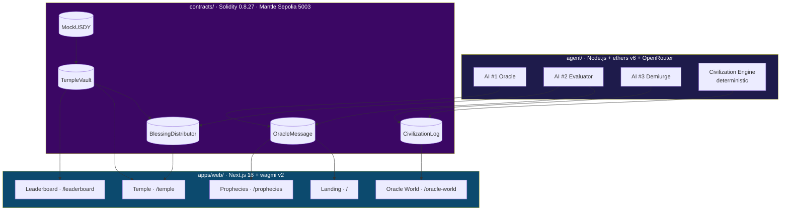

# System Overview

Cult of the Digital Oracle is three independent workspaces that meet only on-chain:

```text
agent/      →  three autonomous AIs + a deterministic world  ─┐
contracts/  →  five Solidity contracts on Mantle Sepolia      ─┼─→ Mantle
apps/web/   →  Next.js frontend + a real-time pixel sim       ─┘
```

No shared backend, no central database. The **chain is the integration layer**: the agent writes, the frontend reads, and the contracts are the single source of truth in between.

***

## The three layers



### `agent/` — the autonomous backend

A single daily process (`runOracleCycle`) drives [three LLM agents](../ai-agents/README.md) and one [deterministic world engine](../ai-agents/civilization-engine.md). It is the only writer of prophecies, verdicts, blessings, snapshots, and divine events. It runs locally, via `npm run dev`, or on a GitHub Actions cron — see [Run the Agent](../deployment/agent.md).

### `contracts/` — the on-chain economy

[Five contracts](../contracts/README.md) hold all state of record: prophecies + verdicts (`OracleMessage`), Disciple identities + faith (`TempleVault`), yield rounds (`BlessingDistributor`), the simulated world's memory (`CivilizationLog`), and the test stablecoin (`MockUSDY`). Each privileged action is gated to a single EOA.

### `apps/web/` — the frontend

A [Next.js 16 app](../frontend/README.md) that is **read-mostly against the chain** for everything the agent produces, and **write** only for user actions (faucet, approve, enter, check-in, claim). It also runs a separate, self-contained [pixel-art world simulation](../frontend/oracle-world.md) in a Web Worker, bridged to the on-chain `CivilizationLog`.

***

## Two clocks, one rhythm

Everything is paced by the **UTC day index**, computed identically on both sides:

| Side | Expression |
|---|---|
| Solidity | `block.timestamp / 1 days` |
| TypeScript | `Math.floor(Date.now() / 86_400_000)` |

This is why the whole system has a heartbeat: one prophecy, one verdict, one snapshot, one divine-event decision **per day**. The agent's cron fires at midnight UTC; the contracts enforce the once-per-day invariants; the frontend derives the same day index to know which prophecy and snapshot to show.

***

## Trust boundaries

| Actor | Can do | Cannot do |
|---|---|---|
| **Oracle EOA** | post prophecies, resolve them, queue blessings | mint Disciples, choose who gets paid |
| **CivEngine EOA** | post snapshots, log divine events, post previews | touch prophecies or funds |
| **Any wallet** | faucet, stake, check-in, share, claim | post prophecies, forge verdicts |
| **Contract owner** | rotate the privileged EOAs, seed yield | bypass the per-day or pro-rata invariants |

The agent holds the Oracle (and optionally CivEngine) private keys. Compromising them would let an attacker post fake prophecies and snapshots — but **not** drain the vault or redirect blessings, because payouts are pure pro-rata math over `TempleVault` state.

***

## Read next

* [Technology Stack](tech-stack.md) — every dependency, and why
* [Data Flow](data-flow.md) — the daily cycle and the user journey as sequence diagrams
* [The Triune Intelligence](../ai-agents/README.md) — the agent layer in depth
* [Smart Contracts](../contracts/README.md) — the on-chain layer in depth
