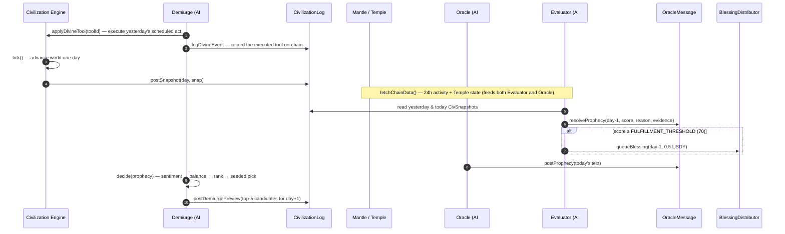
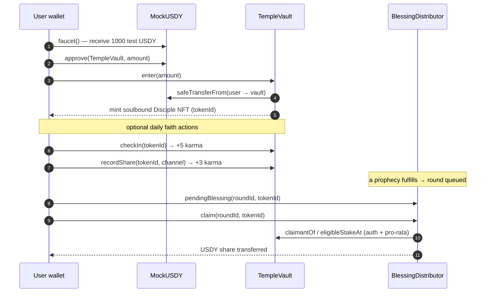
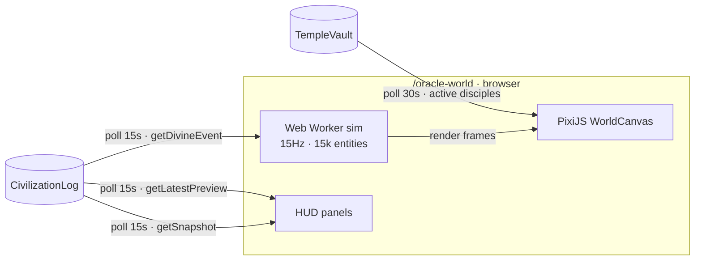

# Data Flow

Two flows define the system: the **daily agent cycle** (machine-driven) and the **Disciple journey** (human-driven). They meet at the contracts.

***

## Flow 1 — the daily oracle cycle

Driven by `runOracleCycle()` in `agent/src/index.ts`, once per UTC day.

**The closed loop:** the Evaluator judges a prophecy partly by the world the Demiurge shaped; the Demiurge schedules its next act by reading the prophecy the Oracle just spoke. Each agent's output is another agent's input — through the chain.

***

## Flow 2 — the Disciple journey

Driven by a user on `/temple`, via wagmi writes.

***

## Flow 3 — the world on screen

Driven by `/oracle-world` polling the chain while a local sim runs.

The browser runs its own continuous world simulation for smooth motion, but **on-chain divine events are bridged in**: every 15 seconds the page reads new `DivineEvent`s from `CivilizationLog` and replays them visually (`triggerDivineTool`). Active Disciples are polled from `TempleVault` and rendered as hero NPCs. See [The Oracle World](../frontend/oracle-world.md).

***

## Where each piece of data lives

| Data | Home | Read by |
|---|---|---|
| Prophecy text + verdict | `OracleMessage` (on-chain) | Landing, `/prophecies`, Evaluator |
| Disciple identity, stake, karma | `TempleVault` (on-chain) | `/temple`, `/leaderboard`, `/disciple/[id]`, BlessingDistributor |
| Blessing rounds + claims | `BlessingDistributor` (on-chain) | `/temple` |
| World snapshots + divine events | `CivilizationLog` (on-chain) | `/oracle-world` |
| Full world state (entities, regions) | agent JSON files + `stateHash` on-chain | agent only (chain holds the commitment) |
| 24h chain metrics | computed live from Mantle RPC | Oracle, Evaluator (not stored) |

The principle: **anything that must be trusted or shown is on-chain; bulky deterministic detail stays off-chain behind a hash.**
