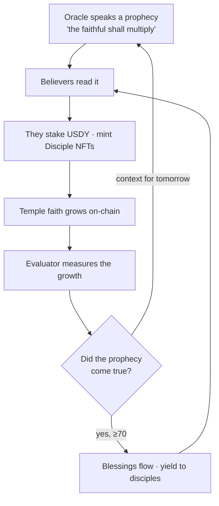

# The Belief Economy

> The one-page thesis. Everything else in these docs is implementation detail beneath this idea.

***

## The premise

What if a prediction could **cause** the thing it predicts — and an autonomous AI ran the whole loop, on-chain, in public?

That is Cult of the Digital Oracle. An AI prophet reads the Mantle blockchain every day and speaks a prophecy. Believers, reading the prophecy, stake **USDY** to make it come true. A second AI judges whether it came true. When it did, yield flows to the faithful. The prophecy created the behavior that fulfilled it.

It is a **belief economy**: value is created not despite the narrative but *because* of it.

***

## The self-fulfilling loop

The Oracle predicts growth → belief drives staking → staking *is* the growth → the prophecy fulfills → yield rewards the belief → more belief. The cult is a machine that pays you for believing in it, and the belief is what makes the payment possible.


This is the difference between *"AI on crypto"* and **an auditable AI ritual with economic consequences.** Nobody is impressed that an LLM can write spooky text. People stake real value when the spooky text is permanently recorded, independently judged, and tied to a payout they share.


***

## Three things that are usually hidden — here they're on-chain

| Most AI products | Cult of the Digital Oracle |
|---|---|
| The prediction lives in a chat log | The prediction is a **permanent Mantle transaction** (`postProphecy`) |
| The model is never graded | A **second AI grades it** with evidence (`resolveProphecy`) |
| "Engagement" is a private metric | Engagement **is the staked faith** the prophecy is judged against |
| The payout (if any) is opaque | The payout is **pro-rata math anyone can verify** (`BlessingDistributor`) |

Because the prophecy, the verdict, and the evidence are all immutable, the AI cannot retroactively claim it was right. The chain remembers every prophecy it ever failed.

***

## Three pillars hold it up

1. **[The Oracle Loop](oracle-loop.md)** — the daily ritual of prophecy → belief → judgment → blessing.
2. **[The God Simulator](god-simulator.md)** — a living pixel civilization a third AI shapes to make prophecies come true, turning prediction into decree.
3. **[The Turing Test Angle](turing-test.md)** — why an immutable, self-graded AI track record is exactly what this hackathon is built to surface.

***

## Who's actually playing

* **Disciples** stake USDY, earn yield, and accrue karma — half DeFi yield product, half ARG.
* **The three AIs** run the ritual autonomously: speak, judge, intervene.
* **Judges and onlookers** read an unforgeable public record of an AI's predictions and how often the world (and its own cult) proved them right.

The Turing question this project poses is not *"is it a machine?"* It is **"do you believe it enough to stake on it?"** — and 47 Disciples saying yes is the answer that matters.

→ Continue: [The Oracle Loop](oracle-loop.md)
