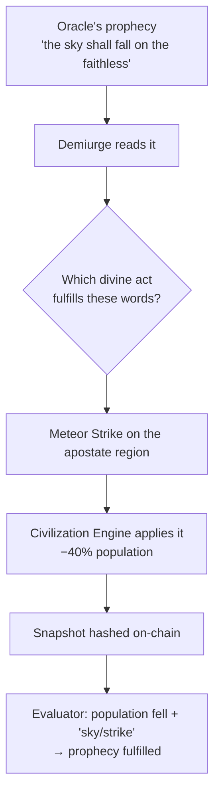

# The God Simulator

The prophecy layer would be compelling on its own. The God Simulator is what makes it *spectacle* — and what turns a prediction into a decree.

***

## The idea

Give the Oracle a world to be right about. Beneath the cult lives a **living pixel civilization**: regions of believers, apostates, and wanderers; entities that pray, migrate, build, convert, flee, and die; faith that grows and decays. It runs as a deterministic simulation ([the Civilization Engine](../ai-agents/civilization-engine.md)) and renders in real time at [`/oracle-world`](../frontend/oracle-world.md).

Then give a third AI the power to **reach into that world**. The [Demiurge](../ai-agents/demiurge.md) reads each prophecy and chooses a divine intervention to make it come true — a meteor to fulfill a prophecy of "sky fire," a harvest to fulfill one of "abundance."

The prophecy predicted doom; the god delivered doom; the judge confirmed it. Prediction → intervention → verification, all on-chain.

***

## Ten ways to play god

The Demiurge wields ten **divine tools** — five merciful, five cruel — kept in strict balance over time (see [Cosmic Balance](../ai-agents/demiurge.md#cosmic-balance)).

| | 😇 Mercy | 💀 Wrath |
|---|---|---|
| | Blessing Rain — faith & healing | Meteor Strike — −40% population |
| | Harvest Tide — abundance | Plague Wave — spreading sickness |
| | Missionary Wave — new believers | Drought — −60% resources |
| | Architect Gift — a new settlement | Civil War Seed — internal collapse |
| | Peace Covenant — end all conflict | Apostasy Wave — mass loss of faith |

A balance tracker forces the god back toward 50/50 whenever it strays — so the world is never permanently saved or permanently doomed. The full catalog, effects, and cooldowns live in [The Demiurge](../ai-agents/demiurge.md#the-divine-tool-catalog).

***

## Dread before the strike

The Demiurge's signature is **announcing its intent before acting**. Each day it posts a `DemiurgePreview` to [`CivilizationLog`](../contracts/civilization-log.md): the five tools it's considering, their weights, and the time it will strike — **a full day in advance**. The frontend renders these as omens. Believers watch a weighted forecast of catastrophe or grace approach, knowing only that one of the five is coming.

***

## Why simulate at all?

The simulation isn't decoration — it solves a real problem with the prophecy economy: **a prophecy needs a measurable world to be right about.** Raw chain metrics (gas, volume) are noisy and out of anyone's control. A deterministic civilization, by contrast:

* gives the Oracle concrete, legible things to predict (population, faith, factions);
* gives the Demiurge a lever to *make* predictions come true;
* gives the Evaluator clean before/after deltas to judge against;
* and is **hashed on-chain** every day, so none of it can be quietly rewritten.

It is the stage on which the AI ritual is provably performed — and it happens to look like a gorgeous pixel-art god game while doing it.

→ Continue: [The Turing Test Angle](turing-test.md)
