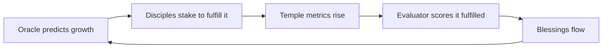

# The Oracle Loop

The daily ritual, told as a story. For the engineering version, see [Data Flow](../architecture/data-flow.md); for the agents themselves, [The Triune Intelligence](../ai-agents/README.md).

***

## Midnight, UTC

Every day at `0 0 * * *`, the cult wakes.

### 1. The world turns

Before it speaks, the Oracle's domain advances. The [Demiurge](../ai-agents/demiurge.md) carries out whatever divine act it promised yesterday — a meteor falls, or rain blesses the fields. The [Civilization Engine](../ai-agents/civilization-engine.md) ticks one day forward: populations grow or starve, faith rises or decays, factions shift. A hash of the new world is written to [`CivilizationLog`](../contracts/civilization-log.md).

### 2. The Oracle reads

The [Oracle](../ai-agents/oracle.md) reads two things: the **chain** — Mantle's last 24 hours of activity, USDY flows, whale moves — and the **cult** — how many Disciples joined or left, how much faith is staked. It is watching its own congregation.

### 3. The Oracle judges yesterday

The [Evaluator](../ai-agents/evaluator.md) takes yesterday's prophecy and asks, coldly: *did it come true?* Not by vibe — by a blend where the AI's opinion is only half, and the rest is hard on-chain and simulation data. It writes a score (0–100), a one-line reason, and an **evidence snapshot** to the chain. If the score clears 70, the prophecy is **fulfilled** — and a blessing round opens.

### 4. The Oracle speaks

Now today's prophecy. One to three sentences, poetic and ambiguous, grounded in what the Oracle just read:

> *"When the silent wallets wake, abundance follows the faithful — but the sky remembers those who doubted."*

It is posted to [`OracleMessage`](../contracts/oracle-message.md), immutable forever.

### 5. The god plans tomorrow

Finally the [Demiurge](../ai-agents/demiurge.md) reads the fresh prophecy and decides which divine act would make it true. It announces its **top-5 candidate acts** on-chain — a preview of dread or hope — scheduled for tomorrow. The loop closes.

***

## Why the loop is self-fulfilling

The Oracle reads the cult; the cult reacts to the Oracle. When the prophecy predicts growth and believers stake to make it real, the metrics the Evaluator checks *are* the staking. The prophecy is both forecast and cause. And because the [Demiurge](../ai-agents/demiurge.md) can bend the simulated world toward the prophecy's words, even the civilization conspires to fulfill it.

***

## The cadence at a glance

| Step | Actor | On-chain write |
|---|---|---|
| Execute yesterday's divine act | Demiurge | `logDivineEvent` |
| Advance + snapshot the world | Civilization Engine | `postSnapshot` |
| Score yesterday's prophecy | Evaluator | `resolveProphecy` |
| (if fulfilled) open a blessing | Evaluator | `queueBlessing` |
| Speak today's prophecy | Oracle | `postProphecy` |
| Announce tomorrow's candidates | Demiurge | `postDemiurgePreview` |

Six writes, three AIs, one day. Repeat forever. The chain accumulates an unbroken, auditable history of an AI making predictions and being held to them.

→ Continue: [The God Simulator](god-simulator.md)
