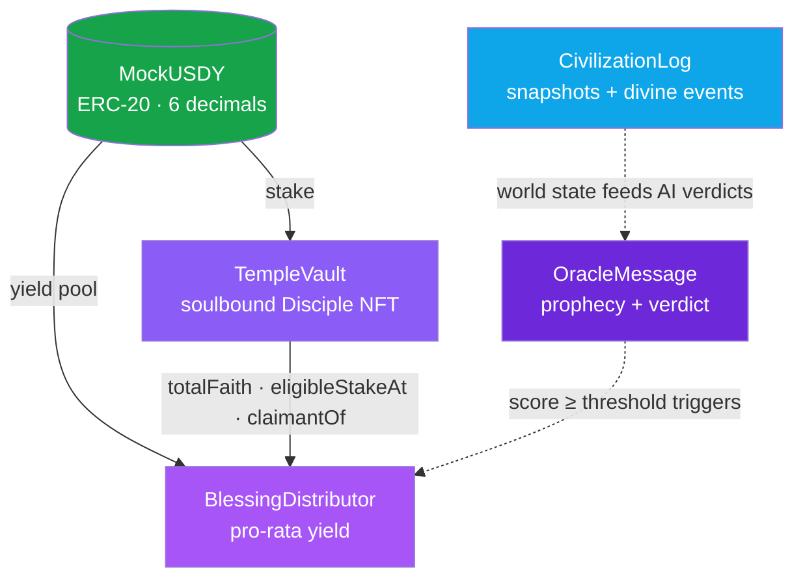

# Smart Contracts Overview

The entire belief economy runs on **five Solidity contracts** deployed to **Mantle Sepolia (chain `5003`)**, written for **Solidity 0.8.27** on the **Cancun EVM** and built on **OpenZeppelin v5**.

There is no off-chain database of record. Prophecies, verdicts, Disciple identities, blessing rounds, and the simulated world's daily state are all on-chain. The agents and the frontend are clients of these five contracts — nothing more.


**Verified addresses** for every contract live on the [Deployment & Addresses](deployment.md) page — that is the single source of truth. The frontend reads them from `NEXT_PUBLIC_*` env vars (`apps/web/src/lib/contracts.ts`); the agent reads them from `agent/.env`.


***

## The five contracts

| Contract | Standard | Who can write | Responsibility |
|---|---|---|---|
| [`OracleMessage`](oracle-message.md) | Custom (`Ownable`) | Oracle EOA | One prophecy + one verdict per UTC day |
| [`TempleVault`](temple-vault.md) | ERC-721 soulbound | Anyone (stake) / Oracle (karma) | USDY stake → Disciple NFT, karma, faith actions |
| [`BlessingDistributor`](blessing-distributor.md) | Custom (`Ownable`) | Oracle (queue) / Disciples (claim) | Pro-rata USDY yield on fulfilled prophecies |
| [`CivilizationLog`](civilization-log.md) | Custom (`Ownable`) | CivEngine EOA | Daily world snapshots + Demiurge divine events |
| [`MockUSDY`](mock-usdy.md) | ERC-20 | Anyone (faucet) | Test stablecoin, 6 decimals |

***

## How they interlock



`BlessingDistributor` is the only contract that reads another contract directly: it calls `TempleVault.totalFaith()`, `eligibleStakeAt()`, and `claimantOf()` to compute each Disciple's share. Everything else is wired together off-chain by the agent.

***

## Design principles

### 1. The UTC day is the universal clock

Three contracts key their state by **`block.timestamp / 1 days`** — an integer day index that every party can compute independently:

```solidity
uint256 day = block.timestamp / 1 days;
```

The agent mirrors it in TypeScript with `Math.floor(Date.now() / 86_400_000)`. This is why there is exactly **one prophecy, one snapshot, and at most one check-in per Disciple, per day** — the day index is the natural unique key.

### 2. Authority is a single EOA per contract

Each writable contract trusts exactly one address:

| Contract | Privileged role | Guard |
|---|---|---|
| `OracleMessage` | `oracle` | `onlyOracle` → `NotOracle()` |
| `TempleVault` | `oracle` (karma only) | `onlyOracle` → `NotOracle()` |
| `BlessingDistributor` | `oracle` (queue only) | `onlyOracle` → `NotOracle()` |
| `CivilizationLog` | `civEngine` | `onlyCivEngine` → `NotCivEngine()` |

The privileged address is set in the constructor and can be rotated by the `Ownable` owner (`setOracle` / `setCivEngine`). Disciple-facing actions (`enter`, `exit`, `checkIn`, `recordShare`, `claim`) are **permissionless** — anyone can be a Disciple.

### 3. Storage is hand-packed for gas

These contracts are deliberately optimized for Mantle's daily write cadence. Structs are laid out so that hot-path guard checks hit a single storage slot:

* `OracleMessage.Prophecy` puts `timestamp + fulfillmentScore + resolved` first → `postProphecy` and `resolveProphecy` validate with a single `SLOAD`.
* `TempleVault.Disciple` packs `address + uint88 stake + bool active` into one slot and `uint128 karma + uint64 joinedAt + uint64 exitedAt` into the next — an `enter()` writes each slot once.
* `BlessingDistributor.BlessingRound` was reduced from 5 slots to **2** by removing dead state and packing `yieldPool + totalFaithSnap` together.

Each contract page documents its slot layout.

### 4. Custom errors, never strings

Every revert path uses a named custom error (`Soulbound()`, `AlreadyResolved()`, `NoActiveFaith()`, …) rather than a revert string — cheaper to deploy, cheaper to revert, and self-documenting in the ABI.

***

## Pitching FAQ

### Q: "Is this just an NFT staking pool with a chatbot on top?"

**A:** No. Three independent things are on-chain that a chatbot wrapper would keep off-chain: (1) the AI's **prediction** (`postProphecy`), (2) the AI's **self-assessment of that prediction** (`resolveProphecy` with score + evidence), and (3) a third AI's **intervention in a simulated world** (`CivilizationLog`). The economic payout (`BlessingDistributor`) is *gated by the AI's own verdict*. The AI has skin in the game of its own predictions.

### Q: "Why are the Disciple NFTs soulbound?"

**A:** A Disciple is an **identity**, not a tradeable asset. If NFTs could be sold, blessing yield would become a speculative claim detached from belief. Soulbinding ties faith (and karma) to a single wallet. `TempleVault._update()` reverts with `Soulbound()` on any transfer that isn't a mint or a burn.

### Q: "What stops the oracle from paying its friends?"

**A:** Blessings are **pro-rata by stake at the moment the round was queued**. The oracle calls `queueBlessing(day, amount)` with a flat USDY amount; the *split* is pure math — `eligibleStakeAt(tokenId, queuedAt) × yieldPool / totalFaithSnap`. The oracle cannot choose who gets paid or how much.

### Q: "How many ERC standards does this use?"

**A:** The Disciple NFT is a **soulbound ERC-721** (`TempleVault`), and the stake token is **ERC-20** (`MockUSDY`, standing in for Mantle's USDY). The other three contracts are custom registries/ledgers built on `Ownable`. The design intent referenced ERC-8004-style on-chain identity; the shipped implementation is a soulbound ERC-721.

### Q: "What happens if the yield pool is empty when a prophecy fulfills?"

**A:** `queueBlessing` reverts with `InsufficientYieldPool()` if the amount is zero, and `NoActiveFaith()` if `totalFaith == 0`. The owner can pre-fund the pool via `seedYield()` for demos. A fulfilled prophecy with no funded pool simply queues nothing — no phantom debt is created.

***

## Read next

* [OracleMessage](oracle-message.md) — the prophecy ledger
* [TempleVault](temple-vault.md) — staking, soulbinding, karma
* [BlessingDistributor](blessing-distributor.md) — the yield math
* [CivilizationLog](civilization-log.md) — the simulated world's on-chain memory
* [MockUSDY](mock-usdy.md) — the test stablecoin
* [Deployment & Addresses](deployment.md) — verified addresses
