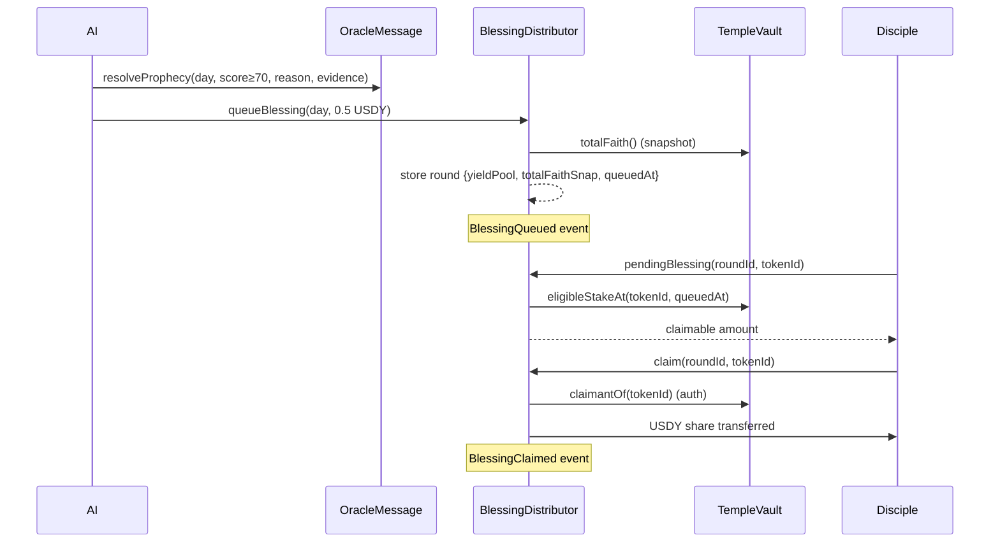

# BlessingDistributor

> `contracts/contracts/BlessingDistributor.sol` · `Ownable`

When a prophecy is judged fulfilled, the Oracle queues a **blessing round** here and each active Disciple claims their pro-rata share of the USDY yield pool. The split is pure arithmetic — the oracle decides *how much* yield, never *who* receives it.

```solidity
contract BlessingDistributor is Ownable
```

***

## The `BlessingRound` struct

```solidity
struct BlessingRound {
    uint128 yieldPool;      // slot 0, bytes  0-15  — total USDY in this round
    uint128 totalFaithSnap; // slot 0, bytes 16-31  — totalFaith captured at queue time
    uint64  day;            // slot 1, bytes  0-7   — UTC day of the fulfilled prophecy
    uint64  queuedAt;       // slot 1, bytes  8-15  — timestamp, used for eligibility
}
```

Originally five slots; trimmed to **two** by removing dead `settled` state and packing the two `uint128` values together. `queueBlessing` writes the whole round in two `SSTORE`s.

***

## State

```solidity
IERC20      public immutable usdy;
TempleVault public immutable vault;
address     public oracle;
uint256     public nextRoundId = 1;

mapping(uint256 => BlessingRound) public rounds;                       // roundId => round
mapping(uint256 => mapping(uint256 => bool)) public claimed;          // roundId => tokenId => claimed?
```

***

## The yield math

When a Disciple claims, their share is:

$$
\text{share} = \frac{\text{eligibleStakeAt}(tokenId,\ queuedAt) \times \text{yieldPool}}{\text{totalFaithSnap}}
$$

```solidity
function _pendingBlessing(BlessingRound storage r, uint256 tokenId) internal view returns (uint256) {
    uint128 snap = r.totalFaithSnap;
    if (snap == 0) return 0;
    uint256 stakeAmount = vault.eligibleStakeAt(tokenId, r.queuedAt);
    if (stakeAmount == 0) return 0;
    return (stakeAmount * r.yieldPool) / snap;
}
```

Both `yieldPool` and `totalFaithSnap` are **frozen at queue time**. A Disciple who stakes *after* the round was queued earns nothing from it; one who exits afterward still earns their frozen share, because `eligibleStakeAt` looks at `queuedAt`, not "now."

***

## Functions

| Function | Access | Purpose | Reverts |
|---|---|---|---|
| `queueBlessing(uint256 day, uint256 yieldAmount)` | `onlyOracle` | Open a round, pull `yieldAmount` USDY from the oracle | `NotOracle`, `InsufficientYieldPool` (amount 0), `NoActiveFaith` (`totalFaith == 0`) |
| `claim(uint256 roundId, uint256 tokenId)` | the original Disciple | Claim your share | `RoundNotFound`, `AlreadyClaimed`, `NotDisciple`, `NothingToClaim` |
| `pendingBlessing(uint256 roundId, uint256 tokenId)` → `uint256` | view | Preview claimable amount | — |
| `rounds(uint256)` | view (mapping) | Round details | — |
| `nextRoundId()` | view | Next round id | — |
| `seedYield(uint256 amount)` | `onlyOwner` | Pre-fund the contract with USDY (demo) | — |
| `setOracle(address)` | `onlyOwner` | Rotate oracle | — |

### `queueBlessing` — the oracle's only lever

```solidity
function queueBlessing(uint256 day, uint256 yieldAmount) external onlyOracle {
    if (yieldAmount == 0) revert InsufficientYieldPool();
    uint256 totalFaithSnap = vault.totalFaith();
    if (totalFaithSnap == 0) revert NoActiveFaith();
    usdy.safeTransferFrom(msg.sender, address(this), yieldAmount);
    // ... assign nextRoundId, write the round
    emit BlessingQueued(id, day, yieldAmount);
}
```

The oracle must have pre-approved `yieldAmount` USDY to this contract. In the live agent, the round amount is a fixed **`YIELD_PER_ROUND = 0.5 USDY`** (`500_000` units at 6 decimals), queued only when the Evaluator's score is **≥ `FULFILLMENT_THRESHOLD` (default 70)**.

### `claim` — gated by original ownership

```solidity
if (vault.claimantOf(tokenId) != msg.sender) revert NotDisciple();
```

Only the **original** staker of `tokenId` can claim — verified through `TempleVault.claimantOf`, which survives an NFT burn. Each `(roundId, tokenId)` can be claimed exactly once (`claimed` mapping).

***

## End-to-end blessing flow



***

## Events

```solidity
event BlessingQueued(uint256 indexed roundId, uint256 day, uint256 yieldPool);
event BlessingClaimed(uint256 indexed roundId, uint256 indexed tokenId, address indexed disciple, uint256 amount);
```

***

## Custom errors

`NotOracle` · `RoundNotFound` · `AlreadyClaimed` · `NothingToClaim` · `InsufficientYieldPool` · `NoActiveFaith` · `NotDisciple`
