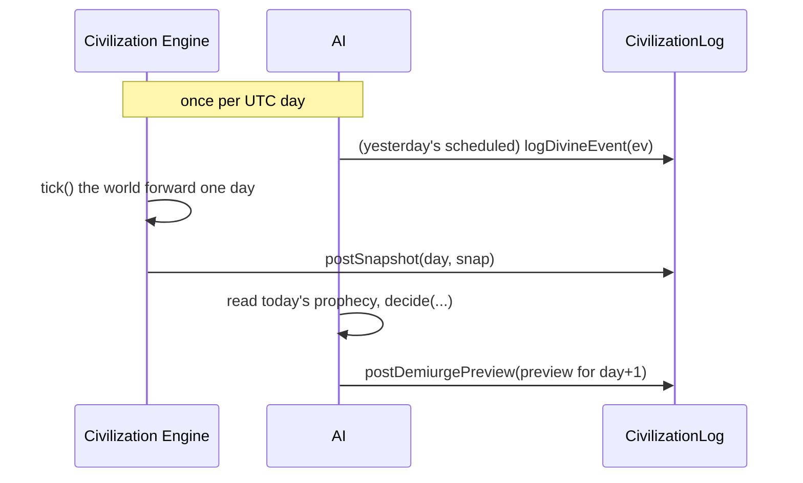

# CivilizationLog

> `contracts/contracts/CivilizationLog.sol` · `Ownable`

The on-chain memory of the **God Simulator**. Every day the Civilization Engine posts a snapshot of the simulated world's state; whenever the Demiurge AI acts, the intervention is logged here; and each day the Demiurge's *intended* top-5 actions are published as a preview before they execute. This is what lets the frontend's [`/oracle-world`](../frontend/oracle-world.md) replay a verifiable, AI-driven world instead of a local toy.

```solidity
contract CivilizationLog is Ownable
```

***

## Three records, one ledger

### `CivSnapshot` — the daily state of the world

```solidity
struct CivSnapshot {
    bytes32 stateHash;       // keccak256 of the full JSON world state
    uint32  totalEntities;   // count of NPC entities
    uint32  totalPopulation; // total population
    uint64  totalFaith;      // aggregate faith (USDY-analog, scaled 1e6)
    uint8   dominantFaction; // 0 = believer, 1 = apostate, 2 = balanced
    uint8   activeRegions;   // count of active regions
    uint64  snapshotAt;      // unix timestamp
}
```

The full simulation lives off-chain (it is large and deterministic). What goes on-chain is a **commitment**: `stateHash` anchors the exact world state, and the aggregate counters make the snapshot independently meaningful. A non-zero `snapshotAt` marks a day as recorded.

### `DivineEvent` — an act of god

```solidity
struct DivineEvent {
    uint8  toolId;       // 0-9 — index into the divine-tool catalog
    uint8  polarity;     // 0 = evil, 1 = good
    uint64 executedAt;   // unix timestamp
    uint8  targetRegion; // region index (255 = all regions)
    uint32 magnitude;    // intensity 0-1000
}
```

Each logged event is one intervention — a meteor on region 3, a golden harvest across all regions. The catalog that `toolId` indexes into is documented in [AI #3 — The Demiurge](../ai-agents/demiurge.md).

### `DemiurgePreview` — tomorrow's intent, declared today

```solidity
struct DemiurgePreview {
    uint8[5] toolIds;        // top-5 candidate tool ids
    uint8[5] weights;        // probability weight 0-100 each
    uint8    forcedPolarity; // 0 = force evil, 1 = force good, 2 = free choice
    uint64   decisionAt;     // when the Demiurge decided
    uint64   scheduledFor;   // when it executes (≈24h later)
    string   prophecyHash;   // excerpt/hash of the prophecy that drove the decision
}
```

The preview is the Demiurge **committing to its hand before playing it**. The frontend shows these five weighted candidates in the `DivineToolsPanel` so viewers can see what the god is *considering* a full day before it acts.

***

## State

```solidity
mapping(uint256 => CivSnapshot) private _snapshots;  // day => snapshot
DivineEvent[] private _divineHistory;                // append-only event log
DemiurgePreview private _latestPreview;              // most recent preview
uint256 public totalSnapshotCount;
address public civEngine;                            // the only authorized writer
```

***

## Functions

| Function | Access | Purpose | Reverts |
|---|---|---|---|
| `postSnapshot(uint256 day, CivSnapshot snap)` | `onlyCivEngine` | Record the day's world state (one per day) | `NotCivEngine`, `SnapshotAlreadyExists` |
| `logDivineEvent(DivineEvent ev)` | `onlyCivEngine` | Append an executed intervention | `NotCivEngine` |
| `postDemiurgePreview(DemiurgePreview preview)` | `onlyCivEngine` | Publish the next-day candidate set | `NotCivEngine` |
| `getSnapshot(uint256 day)` → `CivSnapshot` | view | Read a day's snapshot | — |
| `getDivineEvent(uint256 index)` → `DivineEvent` | view | Read one event | — |
| `getDivineEventCount()` → `uint256` | view | Length of the event log | — |
| `getLatestPreview()` → `DemiurgePreview` | view | The current preview | — |
| `totalSnapshots()` → `uint256` | view | Alias of `totalSnapshotCount` | — |
| `setCivEngine(address)` | `onlyOwner` | Rotate the engine EOA | — |


**Authority note.** All three writers are gated by `onlyCivEngine`. The Demiurge's preview is posted *on behalf of* the Demiurge by the civ-engine wallet (`postDemiurgePreview` is `onlyCivEngine`, not a separate role). In deployment the civ-engine EOA may be the same key as the oracle or a dedicated `CIV_ENGINE_PRIVATE_KEY` — see [Run the Agent](../deployment/agent.md).


***

## Daily write pattern



***

## Events

```solidity
event SnapshotPosted(uint256 indexed day, bytes32 stateHash, uint32 totalPopulation, uint64 totalFaith);
event DivineEventLogged(uint256 indexed eventId, uint8 toolId, uint8 polarity, uint64 executedAt);
event DemiurgePreviewPosted(uint64 scheduledFor, uint8[5] toolIds, uint8 forcedPolarity);
event CivEngineUpdated(address indexed newEngine);
```

The frontend polls `getDivineEventCount` + `getDivineEvent` to replay interventions, and `getLatestPreview` to render the candidate panel.

***

## Custom errors

`NotCivEngine` · `SnapshotAlreadyExists`

***

## Read next

* [AI #3 — The Demiurge](../ai-agents/demiurge.md) — what writes here, and the full divine-tool catalog
* [The Civilization Engine](../ai-agents/civilization-engine.md) — the simulation behind the snapshots
* [The Oracle World](../frontend/oracle-world.md) — how this ledger becomes a living pixel world
