# Deployment & Addresses

Where the contracts live, and how to keep the agent and frontend pointed at the same deployment.

***

## Network

| Setting | Mantle Sepolia (demo) | Mantle (mainnet config) |
|---|---|---|
| Chain ID | `5003` | `5000` |
| RPC | `https://rpc.sepolia.mantle.xyz` | `https://rpc.mantle.xyz` |
| Explorer | `https://sepolia.mantlescan.xyz` | `https://mantlescan.xyz` |

Compiler (`hardhat.config.ts`): Solidity **0.8.27**, optimizer **1000 runs**, EVM **cancun**.

***

## Verified addresses


**Verify before you trust.** `scripts/deploy.ts` deploys fresh contracts on every run and the repo persists **no deployment artifact**, so historical docs in this repo carry more than one address set. Before relying on any address below, confirm it on [Mantlescan Sepolia](https://sepolia.mantlescan.xyz). Then write the confirmed set into **both** `agent/.env` and `apps/web/.env.local` so the stack can't drift.


The **frontend's `NEXT_PUBLIC_*` configuration** (root `README.md` + `apps/web/README.md`, as of 2026-05-19) is:

| Contract | Address | Verify |
|---|---|---|
| `MockUSDY` (USDY) | `0x7ADbf2a8b9348cC1F6Ee88Db12F9415Ee55b9500` | [↗](https://sepolia.mantlescan.xyz/address/0x7ADbf2a8b9348cC1F6Ee88Db12F9415Ee55b9500) |
| `OracleMessage` | `0xA41cA74250229F212367AB7f7b71552d07426Da3` | [↗](https://sepolia.mantlescan.xyz/address/0xA41cA74250229F212367AB7f7b71552d07426Da3) |
| `TempleVault` | `0x7679f4252118FdAa5351CbcfA484965761a98CC4` | [↗](https://sepolia.mantlescan.xyz/address/0x7679f4252118FdAa5351CbcfA484965761a98CC4) |
| `BlessingDistributor` | `0x60Bda6640129221d9819E6fbeF1406c4e105f789` | [↗](https://sepolia.mantlescan.xyz/address/0x60Bda6640129221d9819E6fbeF1406c4e105f789) |
| `CivilizationLog` | **set after deploy** | — |


**Two known caveats in the current repo** (worth fixing before submission):

1. **The agent's `CLAUDE.md` lists a *different* address set** for `OracleMessage` / `TempleVault` / `BlessingDistributor` (`0xB983…`, `0xF83C…`, `0x7502…`) than the frontend READMEs above. Only **`MockUSDY` (`0x7ADb…`) matches across both.** These are almost certainly two separate deploy runs. Re-deploy once and standardize, or pick the live set and write it everywhere.
2. **`CivilizationLog` has no published address** anywhere in the repo (only `CIV_LOG_ADDRESS=` / `NEXT_PUBLIC_CIVILIZATION_LOG_ADDRESS=` placeholders). It is the 4th contract `deploy.ts` deploys — capture its address from the deploy output and fill it into both env files, or `/oracle-world` falls back to mock candidates.


***

## Deploy order

`scripts/deploy.ts` deploys up to five contracts — it deploys `MockUSDY` only when no `USDY_ADDRESS` env var is set (the default demo path), otherwise it reuses the provided USDY token — and wires the rest in this order:

```mermaid
graph LR
    U[1 · MockUSDY] --> O[2 · OracleMessage&#40;oracle&#41;]
    U --> T[3 · TempleVault&#40;usdy, oracle&#41;]
    T --> B[4 · BlessingDistributor&#40;usdy, vault, oracle&#41;]
    C[5 · CivilizationLog&#40;civEngine&#41;]
```



`TempleVault` needs the USDY address; `BlessingDistributor` needs both USDY and the vault; `OracleMessage` and `CivilizationLog` take their privileged EOA. Capture **every** printed address (five on the demo path; four if you reused an existing `USDY_ADDRESS`).

```bash
cd contracts
cp .env.example .env        # fill PRIVATE_KEY, ORACLE_ADDRESS, …
npx hardhat compile
npx hardhat run scripts/deploy.ts --network mantleSepolia
```

Then propagate the addresses — see [Deploy Contracts](../deployment/contracts.md) for the full procedure, [Run the Agent](../deployment/agent.md), and [Deploy the Frontend](../deployment/frontend.md).

***

## Single source of truth

| Consumer | Reads addresses from |
|---|---|
| Frontend | `apps/web/.env.local` → `apps/web/src/lib/contracts.ts` (`CONTRACTS`) |
| Agent | `agent/.env` (loaded in `agent/src/index.ts`) |

Keep these two in lockstep. The whole system's correctness depends on the agent and the frontend talking to the *same* five contracts.
