# MockUSDY

> `contracts/contracts/MockUSDY.sol` · `ERC20`

A minimal test stand-in for **USDY**, Mantle's real-world-asset stablecoin, used so the full stake → mint → bless flow works on Sepolia without needing the real token. Six decimals, an open `mint`, and a one-call `faucet`.

```solidity
contract MockUSDY is ERC20
```

***

## The whole contract

```solidity
contract MockUSDY is ERC20 {
    constructor() ERC20("Mock USDY", "mUSDY") {}

    function decimals() public pure override returns (uint8) { return 6; }

    function mint(address to, uint256 amount) external {
        _mint(to, amount);
    }

    /// Convenience: mint 1000 USDY to caller
    function faucet() external {
        _mint(msg.sender, 1_000 * 10 ** 6);
    }
}
```

| Detail | Value |
|---|---|
| Name / symbol | `Mock USDY` / `mUSDY` |
| Decimals | **6** (matches real USDY) |
| `mint(to, amount)` | Open — anyone can mint any amount to any address |
| `faucet()` | Mints **1,000 USDY** (`1_000 * 10**6` units) to the caller |


**Testnet only.** The open `mint`/`faucet` are intentional for the hackathon demo so judges can fund a wallet in one click. On a real deployment, the stake token would be the genuine USDY contract on Mantle — this mock would not exist.


***

## Why 6 decimals matters everywhere

Every USDY amount in the system is denominated in 6-decimal units, and several constants depend on it:

* `BlessingDistributor` queues **`0.5 USDY` = `500_000` units** per fulfilled round.
* `TempleVault.stakeAmount` is a `uint88`, comfortably holding any realistic stake at 6 decimals.
* The frontend formats balances with `viem`'s `formatUnits(value, 6)` and parses inputs with `parseUnits(input, 6)`.

If you swap in a token with different decimals, every one of these has to change.

***

## In the user flow

```mermaid
graph LR
    F[faucet&#40;&#41; → 1000 mUSDY] --> A[approve&#40;TempleVault, amount&#41;]
    A --> E[TempleVault.enter&#40;amount&#41;]
    E --> M[Disciple NFT minted]
```



The `/temple` page wires exactly this: **Faucet → Approve → Enter**. See [TempleVault](temple-vault.md) and the [Demo Walkthrough](../demo/walkthrough.md).
