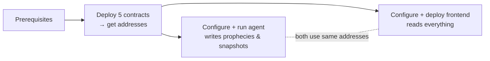

# Deployment Guide

Shipping your own oracle is three deployments in order: **contracts → agent → frontend**. Each depends on the addresses from the step before.

***

## The order, and why

1. **[Prerequisites](prerequisites.md)** — a funded Mantle Sepolia wallet, an OpenRouter key, Node 20+.
2. **[Deploy Contracts](contracts.md)** — `npx hardhat run scripts/deploy.ts` deploys all five and prints their addresses. **Everything downstream needs these.**
3. **[Run the Agent](agent.md)** — fill `agent/.env` with those addresses + your keys, then run a cycle. The agent must run at least once before there's any prophecy to display.
4. **[Deploy the Frontend](frontend.md)** — fill `apps/web/.env.local` with the **same** addresses, build, and deploy to Vercel.


The single most common deployment mistake is **address drift** — the agent writing to one deployment while the frontend reads another. `scripts/deploy.ts` deploys fresh contracts every run with no persisted artifact, so it's easy to end up with two sets. Pick one set, put it in **both** `agent/.env` and `apps/web/.env.local`, and verify on Mantlescan. See [Deployment & Addresses](../contracts/deployment.md).


***

## Quick verification

After all three are deployed, the end-to-end smoke test (from the repo's `INTEGRATION_TEST.md`) confirms the whole stack agrees:

1. `npx tsx scripts/verifyEnv.ts` in `agent/` → all green, balance > 0.05 MNT, `CIV_LOG_ADDRESS` has code.
2. `npm run dev` the agent → watch it post a snapshot, a prophecy, and a Demiurge preview.
3. Open `/oracle-world` → the Demiurge panel shows the on-chain preview, not mock candidates.

→ Start at [Prerequisites](prerequisites.md).
