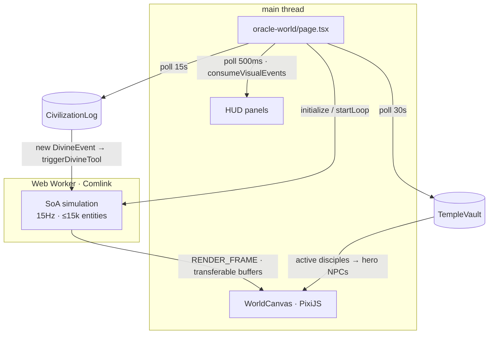

# The Oracle World

> `apps/web/src/app/oracle-world/page.tsx` + `lib/simulation/*` + `components/OracleWorld/*`

`/oracle-world` is the God Simulator made visible — a real-time, 15,000-entity pixel civilization rendered with PixiJS, simulated in a Web Worker, and **bridged to the on-chain [`CivilizationLog`](../contracts/civilization-log.md)** so the [Demiurge's](../ai-agents/demiurge.md) divine acts play out on screen. It is the most technically ambitious surface in the project and the centerpiece of the live demo.

***

## What you see

A full-screen pixel continent — seas, sand, grass, forest, mountains, snow — dotted with villages of Humans, Orcs, and Elves who walk, build, fight, board boats, and flee. Over it floats a HUD of pixel panels:

| Panel | Component | Shows |
|---|---|---|
| **Demiurge Sector** | `DivineToolsPanel` | Countdown to the next divine act + the top-5 weighted candidate tools (from `getLatestPreview`) |
| **Cosmic Alignment Index** | `BalanceIndicator` | The rolling 10-slot good/evil balance (🌟/💀), warning when it skews |
| **Prophecy** | `ProphecyOverlay` | A typewriter-rendered daily prophecy + prediction chips |
| **Event Log** | `EventLog` | A green-terminal feed of world events |
| **Entity Info** | `EntityInfoCard` | Hover details for a region or NPC (faith, health, karma bars) |

***

## Architecture

The **simulation runs off the main thread** in a Web Worker (wrapped with Comlink), so a 15Hz tick over thousands of entities never blocks rendering. Render frames are shipped back via raw `postMessage` with **transferable buffers** — the renderer only draws; it never simulates.

***

## The client simulation

`lib/simulation/` is a self-contained world engine, deliberately separate from the agent's [Civilization Engine](../ai-agents/civilization-engine.md). It exists to look *alive* at 60fps, not to be the canonical sim.

**Tunables** (`types.ts`):

| Constant | Value |
|---|---|
| `WORLD_TILES` | `1024` (16,384px world at `TILE_PX = 16`) |
| `MAX_ENTITIES` | `15000` |
| `MAX_BUILDINGS` | `5000` |
| tick rate | 15Hz (`~66ms`), HUD update 1Hz |

**Map generation** (`mapGen.ts`): FastNoiseLite OpenSimplex2 height/moisture/forest noise with a radial island falloff produces a single continent across 7 biomes (deep sea → snow). Mulberry32 RNG scatters trees, grass, docks, and boats deterministically from the seed.

**The world worker** (`worker.ts`): a zero-GC Structure-of-Arrays engine. NPCs follow a "hate triangle" (Human↔Orc, Orc↔Elf) with attack ranges and cooldowns; boats ferry passengers across water to sand; villages spawn with great halls, monuments, castles, huts, walls, and farms. Semantically, the agent's factions map to races: **believer → Human, apostate → Orc, wanderer → Elf.**

***

## Bridging the chain

The page polls `CivilizationLog` every **15 seconds**:

* `getLatestPreview()` → the Demiurge's five weighted candidate tools, rendered in the Demiurge Sector.
* `getDivineEventCount()` + `getDivineEvent(i)` → the last 10 divine events; new ones are pushed into the worker via `triggerDivineTool(toolId, regionId)` and into the balance history (polarity `1` good / `0` evil). A cursor (`lastSeenEventCount`) avoids replaying history; `targetRegion == 255` means a random region.
* `getSnapshot(dayIndex)` → today's aggregate world stats for the HUD.

Active **Disciples** are polled from `TempleVault` every **30 seconds** and rendered as named "hero" NPCs you can hover.

When a divine event fires, a visual-event queue (polled every **500ms**) plays a Web-Audio chiptune cue — a bright triangle arpeggio for good acts, a descending sawtooth sweep for evil ones.

***

## Two tool vocabularies {#two-tool-vocabularies}

The same `toolId` means one thing to the canonical sim and is *dressed* differently for the screen. The on-chain `toolId` is the shared contract between them:

| toolId | Backend effect ([catalog](../ai-agents/demiurge.md#the-divine-tool-catalog)) | Frontend visual (`lib/simulation/divineTools.ts`) |
|:--:|---|---|
| 0 | Blessing Rain | Blessing Rain ✨ — heal in radius |
| 1 | Harvest Tide | Bountiful Harvest 🌾 — spawn fauna |
| 2 | Missionary Wave | Spawn Missionaries 🕯️ — spawn humans |
| 3 | Architect Gift | Found Settlement 🏛️ — spawn buildings |
| 4 | Peace Covenant | Shield of Faith 🛡️ — +health to humans |
| 5 | Meteor Strike | Meteor Strike ☄️ — crater + destroy buildings |
| 6 | Plague Wave | Plague Wave ☠️ — damage in radius |
| 7 | Drought | **Orc Horde 👹** — spawn 100 orcs |
| 8 | Civil War Seed | **Famine 🥀** — kill 40% of fauna |
| 9 | Apostasy Wave | Whisper Apostasy 🌀 — convert humans → orcs |


The divergence on tools **7 and 8** is intentional theming, not a bug: the authoritative *economic/sim* outcome is the [backend catalog](../ai-agents/demiurge.md#the-divine-tool-catalog); the browser layer renders a crowd-pleasing equivalent (an orc invasion reads better on screen than a resource counter dropping). They are linked only by `toolId`.


***

## Atlases & rendering

`atlas-loader.ts` loads `/oracle-world/manifest.json` and four WebP sprite atlases via PixiJS `Assets` (nearest-neighbor scaling for crisp pixels):

| Atlas | File | Contents |
|---|---|---|
| **units** | `units.webp` | ~30 NPC types (villager, knight, mage, king, orc, elf, fauna…) |
| **buildings** | `buildings.webp` | 20 building subtypes per race (primitive → modern) + walls, monuments, great halls |
| **vfx** | `vfx.webp` | 8 effects: magic bolt, meteor, lightning, raindrop, snowflake, explosion, arrow, axe |
| **env** | `env.webp` | 9 biome tiles + boats, docks, trees, grass |

The manifest declares **140 frames** at `spriteSize 64` / `tileSize 16`. These are the assets generated from the project's [pixel-art pipeline](pixel-art.md).

***

## Known gap (be honest in the demo)


The prophecy text shown in the `ProphecyOverlay` is currently **hardcoded** (it alternates on `dayIndex % 2`), not read from `OracleMessage`. The *divine events*, *previews*, *balance*, and *snapshots* in the Oracle World **are** live on-chain reads. The live prophecy itself is shown on the landing page (`/`) and archive (`/prophecies`). Wiring the overlay to `OracleMessage.todaysProphecy` is a small, high-value follow-up.


***

## Local sandbox

In development the page exposes a Sandbox modal that fires tools 0, 2, 3, 5, 6, 9 on a random region without touching the chain — handy for tuning visuals. For an **on-chain** demo trigger, use the agent's `demoTriggerEvent.ts` (see [Demo Walkthrough](../demo/walkthrough.md)).

→ [The Demiurge](../ai-agents/demiurge.md) · [CivilizationLog](../contracts/civilization-log.md) · [Pixel-Art Asset Pack](pixel-art.md)
