# Pages & Components

Every route, what it reads and writes, and the components that build it.

***

## Routes

| Route | Purpose | Reads | Writes |
|---|---|---|---|
| `/` | Landing — today's live prophecy | `OracleMessage.todaysProphecy` | — |
| `/temple` | The core flow | `MockUSDY`, `TempleVault`, `BlessingDistributor` | `faucet`, `approve`, `enter`, `checkIn`, `recordShare`, `claim` |
| `/prophecies` | Archive of all prophecies | `OracleMessage` (batch read of recent days) | — |
| `/prophecies/[day]` | One prophecy + its verdict & evidence | `OracleMessage.getProphecy(day)` | — |
| `/leaderboard` | Disciples ranked by faith, karma, seniority | `TempleVault.disciples`, `cardOf`, `totalFaith` | — |
| `/disciple/[tokenId]` | Shareable identity card | `TempleVault.disciples(tokenId)` | `recordShare` (share action) |
| `/oracle-world` | The live God Simulator | `CivilizationLog`, `TempleVault` | — (sandbox writes in dev only) |
| `/api/og/disciple/[tokenId]` | Dynamic OG image (edge runtime) | `TempleVault` | — |
| `/api/eth-rpc` | Mainnet RPC proxy | — | — |

***

## `/` — Landing

The landing renders **today's prophecy live from chain** via `<TodaysProphecy />`, framed in pixel chrome with ambient floating runes. A `<ProphecyCountdown />` ticks toward the next midnight-UTC cycle. The mood is set immediately: a glowing oracle, an eerie omen, a single "Enter the Temple" call to action.

***

## `/temple` — the core flow

The heart of the dApp. The full Disciple journey happens here as a sequence of wagmi writes:

```mermaid
graph LR
    F["faucet&#40;&#41;<br/>1000 mUSDY"] --> A["approve&#40;vault, amount&#41;"]
    A --> E["enter&#40;amount&#41;<br/>mint Disciple NFT"]
    E --> C["checkIn / recordShare<br/>earn karma"]
    C --> CL["claim&#40;roundId, tokenId&#41;<br/>when blessed"]
```



The page shows the connected wallet's Disciple card (via `cardOf` → `disciples`), its [mystical name](#deterministic-disciple-names), karma, stake, and any `pendingBlessing` ready to claim. Transaction states use pixel spinners and a claim-burst effect.

***

## `/prophecies` — the archive

Batch-reads the last N days of prophecies from `OracleMessage` and lists them with their fulfillment scores and badges (✓ fulfilled / hourglass pending). Each links to `/prophecies/[day]`, which shows the full prophecy text, the Evaluator's score, its one-line `reason`, and the on-chain `evidence` string — the complete audit trail of a single prediction.

***

## `/leaderboard`

Ranks active Disciples by faith staked, karma, and seniority (`joinedAt`). Each row renders the Disciple's deterministic name and card. This is a viral surface — *"I am Disciple #7"* — and links to shareable cards.

***

## `/disciple/[tokenId]` + OG image

A public, shareable identity card for any Disciple. The matching edge route `/api/og/disciple/[tokenId]` generates a **dynamic Open Graph image** (via `next/og`/Satori) so a shared link unfurls into a pixel-art card on X/Twitter — name, karma, stake, rank. This is the project's primary growth loop. See [Virality Plan](../launch/virality.md).

***

## Key components

| Component | Role |
|---|---|
| `TodaysProphecy` | Live prophecy reader for the landing |
| `ProphecyCountdown` | Time-to-next-cycle ticker |
| `ConnectButton` | ConnectKit wallet connect, themed |
| `OracleSprite` / `OracleButton` | The animated oracle figure + pixel buttons |
| `PixelFrame` / `PanelCorners` | 9-slice pixel panel chrome |
| `AmbientRunes` | Floating rune particle ambiance |
| `OracleWorld/*` | The God Simulator HUD (see [The Oracle World](oracle-world.md)) |

***

## Deterministic Disciple names

Every wallet gets a stable, mystical name with **no storage and no randomness** — `lib/discipleName.ts` derives it from the address bytes:

```ts
epithet = EPITHETS[byte0 % 32];   // "The Ashen", "The Void", "The Crimson"…
title   = TITLES[byte1 % 32];     // "Prophet", "Harbinger", "Revenant"…
// optional suffix when byte2 % 3 === 0
suffix  = SUFFIXES[byte3 % 17];   // "of the Chain", "of the Ledger", "of Mantle"…
```

→ e.g. *"The Ashen Keeper"*, *"Void Warden of the Chain"*. The same wallet always renders the same name across the leaderboard, its card, and the temple. `generateDiscipleQuote(address)` similarly picks one of 25 flavor quotes. It's identity theatre with zero gas.

→ [The Oracle World](oracle-world.md) · [Pixel-Art Asset Pack](pixel-art.md)
